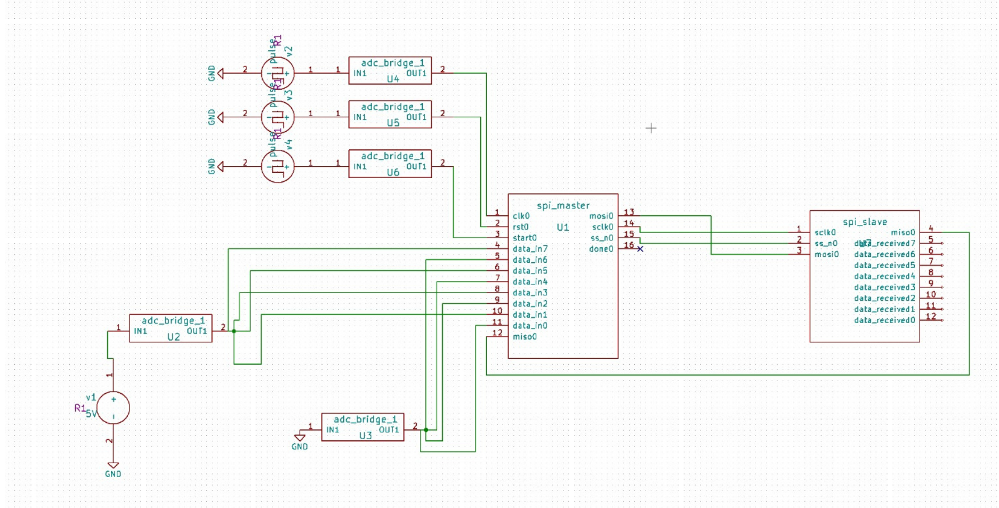
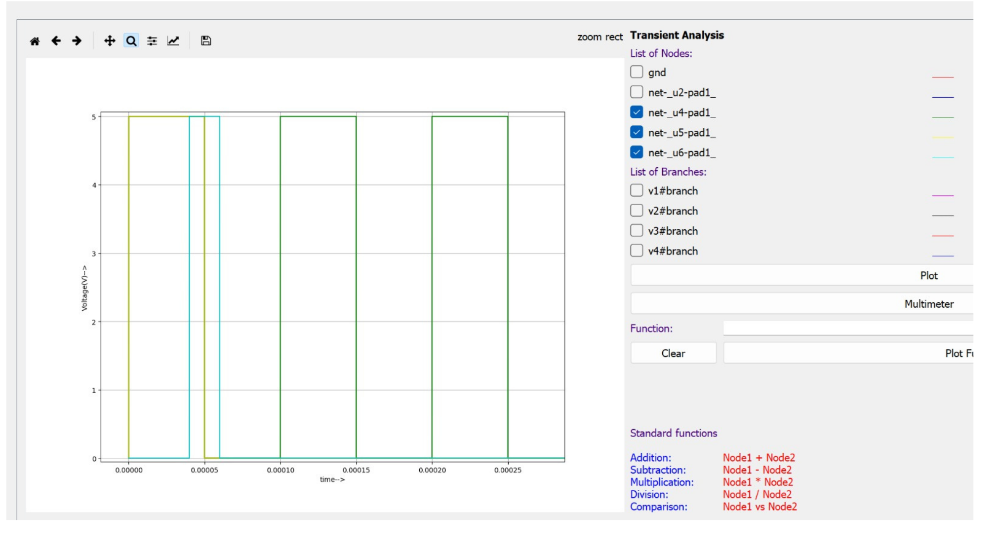

# 8-Bit SPI Master-Slave System

## Overview
This repository contains the design and simulation of an 8-bit Serial Peripheral Interface (SPI) Master-Slave communication system. The circuit was designed and verified using the open-source EDA tool, eSim. 

This project was developed as part of a circuit simulation initiative and served as the technical screening task for the FOSSEE (IIT Bombay) Semester-Long Internship.

### Circuit Schematic

### Simulation Waveforms

## Repository Structure
* **`src/`**: Contains the circuit schematic (`.sch`) and netlist (`.cir`) files.
* **`sim/`**: Contains simulation output waveforms and data.
* **`docs/`**: Contains related documentation and project certificates.

## Tools Used
* **eSim**: Open-source EDA tool for circuit design, simulation, and PCB design.
* **Ngspice**: Mixed-level/mixed-signal circuit simulator.# 8-Bit SPI Master-Slave System

## Overview
This repository contains the design and simulation of an 8-bit Serial Peripheral Interface (SPI) Master-Slave communication system. The circuit was designed and verified using the open-source EDA tool, eSim. 

This project was developed as part of a circuit simulation initiative and served as the technical screening task for the FOSSEE (IIT Bombay) Semester-Long Internship.

## Repository Structure
* **`src/`**: Contains the circuit schematic (`.sch`) and netlist (`.cir`) files.
* **`sim/`**: Contains simulation output waveforms and data.
* **`docs/`**: Contains related documentation and project certificates.

## Tools Used
* **eSim**: Open-source EDA tool for circuit design, simulation, and PCB design.
* **Ngspice**: Mixed-level/mixed-signal circuit simulator.

